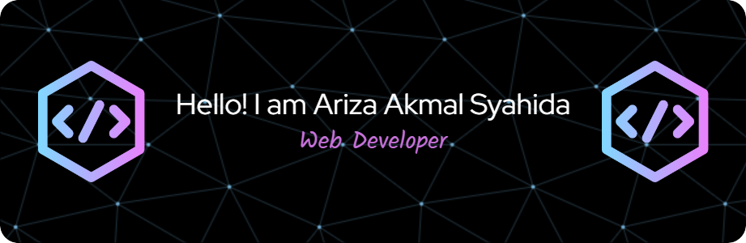

# 💫 About Me:

Hello! 👋 I'm Ariza Akmal Syahida, a Web Developer based in Yogyakarta, Indonesia. I hold a Bachelor's degree in Informatics from Amikom University. I have hands-on experience building web applications using Laravel and Express.js for the backend, and React for the frontend. I'm passionate about continuous learning and committed to growing as a Full Stack Web Developer.

# 🌐 Socials:

  

# 💻 Tech Stack:

                              

# 📊 GitHub Stats:

---

<!-- Proudly created with GPRM ( https://gprm.itsvg.in ) -->
